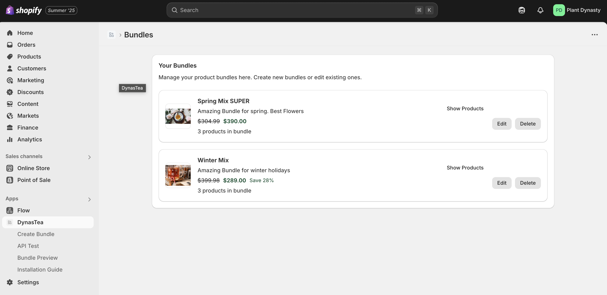

# Shopify Bundle App - Development Challenges & Solutions

A Remix-based Shopify app for creating product bundles with image uploads and product selection.



## 🚀 Features
- Product bundle creation with target product selection
- Image uploads via Shopify's CDN
- Native Shopify product picker integration
- Prisma database with proper relations
- Form validation and error handling

## 🔧 Development Challenges & Solutions

### 1. **Product Selection Integration**
**Challenge**: Implementing Shopify's native product picker for bundle target products.

**Solution**: 
- Created reusable `ProductPicker` component (`app/components/ProductPicker.jsx`)
- Used Shopify's `ResourcePicker` component for native product selection
- Handled product data extraction and form submission

**Files**: `app/components/ProductPicker.jsx`, `app/routes/app.create-bundle.jsx:280-290`

---

### 2. **Image Upload System**
**Challenge**: Allowing users to upload images from their computer to Shopify's CDN.

**Solution**:
- Implemented staged uploads using Shopify's GraphQL API
- Created `ImagePicker` component with file upload capability
- Used `stagedUploadsCreate` and `fileCreate` mutations

**Files**: `app/components/ImagePicker.jsx`, `app/routes/app.create-bundle.jsx:50-130`

---

### 3. **Prisma Schema Relations**
**Challenge**: Database schema mismatch between singular `targetProduct` field and plural expectations.

**Solution**:
- Updated schema to use proper one-to-one relation between `Bundle` and `TargetProduct`
- Fixed field names: `imageAlt`, `imageSource`, `sourceId`
- Reset database and ran migrations

**Files**: `prisma/schema.prisma:45-75`, `app/models/Bundle.server.js:101-116`

---

### 4. **Bundle Creation Data Structure**
**Challenge**: Prisma expecting nested object for `targetProduct` relation but receiving string.

**Solution**:
- Changed from individual fields to nested create structure:
```javascript
targetProduct: {
  create: {
    productId: formData.get("targetProductId"),
    productHandle: formData.get("targetProductHandle"),
    // ... other fields
  }
}
```

**Files**: `app/routes/app.create-bundle.jsx:150-165`, `app/models/Bundle.server.js:120-135`

---

### 5. **Validation Logic Mismatch**
**Challenge**: `validateBundle()` function checking for `targetProductId` field that no longer existed.

**Solution**:
- Updated validation to check nested structure: `data.targetProduct.create.productId`
- Fixed validation logic in `validateBundle()` function

**Files**: `app/models/Bundle.server.js:101-116`

---

### 6. **Foreign Key Constraint Violation**
**Challenge**: Bundle creation failing due to missing shop record in database.

**Solution**:
- Added shop upsert logic before bundle creation
- Ensured shop exists in database before creating related records

**Files**: `app/routes/app.create-bundle.jsx:25-35`

---

### 7. **Database Schema Synchronization**
**Challenge**: Database out of sync with Prisma schema after schema changes.

**Solution**:
- Reset database: `npx prisma db push --force-reset`
- Applied new schema with proper relations
- Verified all tables and fields match schema

**Files**: `prisma/schema.prisma`, Database reset commands

---

### 8. **Route File Confusion**
**Challenge**: Two similar route files causing confusion: `app.create-bundle.jsx` vs `app.create-bundle.$id.jsx`.

**Solution**:
- Used correct route file: `app/routes/app.create-bundle.jsx`
- Removed or ignored the `$id` version to avoid conflicts

**Files**: `app/routes/app.create-bundle.jsx` (correct), `app/routes/app.create-bundle.$id.jsx` (ignored)

---

### 9. **GraphQL Error Handling**
**Challenge**: Insufficient error handling for Shopify GraphQL API calls.

**Solution**:
- Added comprehensive error checking for `userErrors` in GraphQL responses
- Implemented proper error messages for upload failures
- Added debugging logs for troubleshooting

**Files**: `app/routes/app.create-bundle.jsx:70-85`, `app/routes/app.create-bundle.jsx:110-120`

---

### 10. **Update Bundle Function**
**Challenge**: `updateBundle()` function not handling one-to-one relations properly.

**Solution**:
- Used Prisma's `upsert` operation for targetProduct relation
- Properly handled create/update scenarios for existing bundles

**Files**: `app/models/Bundle.server.js:140-155`

---

### 11. **Product Image Preview Issue**
**Challenge**: Product thumbnails not displaying after selection due to incorrect image data extraction from Shopify resource picker.

**Solution**:
- Identified that Shopify resource picker returns images with `originalSrc` property instead of `src`
- Updated image extraction logic to use correct property names: `images[0].originalSrc` for URL and `images[0].altText` for alt text
- Added fallback chain for different possible data structures
- Added debugging to identify the actual data structure returned by resource picker

**Files**: `app/components/ProductPicker.jsx:25-35`, `app/routes/app.create-bundle.jsx:230-240`

---

### 12. **Bundle Image Upload Challenges & Solutions**

#### **Challenge 1: Shopify API Permissions**
**Problem**: `GraphqlQueryError: Access denied for stagedUploadsCreate field`
- App lacked `write_files` permission for Shopify's staged uploads API

**Solution**: 
- Added `write_files` scope to `shopify.app.toml:4`
- Redeployed app with `npm run deploy` to apply new permissions

**Files**: `shopify.app.toml:4`, Deployment command

---

#### **Challenge 2: Form Data Parsing Issues**
**Problem**: Form data received as `[object Object]` instead of string values
- `unstable_parseMultipartFormData` not properly parsing form fields

**Solution**:
- Fixed form data parsing in action function (`app/routes/app.create-bundle.jsx:15-25`)
- Added proper string conversion for non-file fields
- Added debugging to verify data types and values

**Files**: `app/routes/app.create-bundle.jsx:15-25`, `app/routes/app.create-bundle.jsx:35-45`

---

#### **Challenge 3: Staged Upload Signature Mismatch**
**Problem**: `403 signature mismatch` error when uploading to Google Cloud Storage
- Complex staged upload process with FormData construction issues

**Solution**:
- Replaced complex staged upload with simple base64 data URL conversion
- Eliminated external upload dependencies causing signature issues
- Implemented direct image storage in database as data URLs

**Files**: `app/routes/app.create-bundle.jsx:90-110`, `app/routes/app.create-bundle.jsx:115-125`

---

#### **Challenge 4: Corrupted Data Cleanup**
**Problem**: Old bundles with `[object Object]` titles causing GraphQL errors
- Invalid product IDs causing `Variable $id of type ID! was provided invalid value`

**Solution**:
- Added automatic cleanup of corrupted bundles in action function
- Implemented product ID validation in `supplementBundleData()` function
- Added error handling to skip invalid product IDs instead of failing

**Files**: `app/routes/app.create-bundle.jsx:5-15`, `app/models/Bundle.server.js:45-65`

---

#### **Challenge 5: Image Display in Bundle List**
**Problem**: Uploaded images not showing in bundles list
- Image URLs were empty strings in database

**Solution**:
- Base64 data URLs work immediately in browser without external dependencies
- Images display correctly using existing `Thumbnail` component
- No additional frontend changes needed for image display

**Files**: `app/routes/app._index.jsx:40-50`, `app/components/Thumbnail.jsx`

---

## 🛠 Tech Stack
- **Framework**: Remix
- **Database**: SQLite with Prisma ORM
- **UI**: Shopify Polaris
- **Authentication**: Shopify App Bridge
- **File Storage**: Shopify CDN

## 📁 Key Files
- `app/routes/app.create-bundle.jsx` - Main bundle creation route
- `app/components/ProductPicker.jsx` - Product selection component
- `app/components/ImagePicker.jsx` - Image upload component
- `app/models/Bundle.server.js` - Database operations
- `prisma/schema.prisma` - Database schema

## 🚀 Getting Started
1. Install dependencies: `npm install`
2. Set up environment variables
3. Run database migrations: `npx prisma db push`
4. Start development server: `npm run dev`
